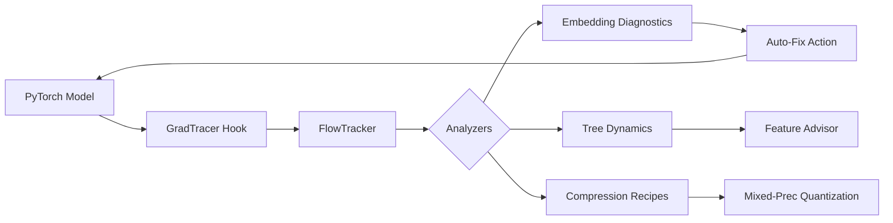

# 🏗️ GradTracer Architecture & Core Concepts

GradTracer is designed with a **low-overhead, non-intrusive** architecture for production-level model diagnostics and automated interventions.

---

## 1. High-Level Design

The library operates on three layers:

1.  **Flow Layer (`Tracker`)**:
    The base layer that intercepts training signals (gradients, weights, and losses). It uses **PyTorch Hooks** to capture `dG/dt` without requiring changes to the model's core `forward()` or `backward()` methods.
    
2.  **Diagnostic Layer (`Analyzers`)**:
    Specialized modules (Embedding, GBDT, Compression) that process the raw training dynamics into actionable insights (e.g., Identifying "Zombie" states or "Gini Bias").
    
3.  **Prescription Layer (`Advisors` & `Auto-Fix`)**:
    The decision layer that recommends architectural changes (Feature interactions, Pruning plans) or actively intercepts gradients (`Auto-Fix`) to prevent representation collapse.

---

## 2. Core Modules

### 🌊 FlowTracker
The central hub for data collection. 
- **Lazy Evaluation**: Diagnostics are only computed every `track_interval` steps.
- **DDP Handling**: Aggregates statistics across distributed GPUs using `all_reduce`.

### 🧬 EmbeddingTracker
Optimized for the high-sparsity, high-velocity updates of Recommendation Systems.
- **Bayesian Auto-Fix**: Uses empirical gradient SNR to penalize oscillating weights.
- **Audit Logging**: Saves all interventions to `.gradtracer/audit.jsonl` for reproducibility.

### 🌲 TreeDynamicsTracker
Unpacks the internal structure of GBDT ensembles (XGBoost/LightGBM).
- **Concentration Analysis**: Measures if certain features are "over-used" leading to stagnation.
- **Interaction Discovery**: Finds Parent-Child paths that represent strong non-linear interactions.

---

## 3. Data flow

---

## 4. Performance Strategy

To maintain `< 5%` overhead on enterprise GPUs:
- **Zero-Copy**: Operations use `tensor.view()` and in-place math wherever possible.
- **Asynchronous Capture**: Statistics are calculated outside the critical path when possible.
- **Cuda Synchronized**: Precision benchmarks ensure zero kernel-blocking calls.
